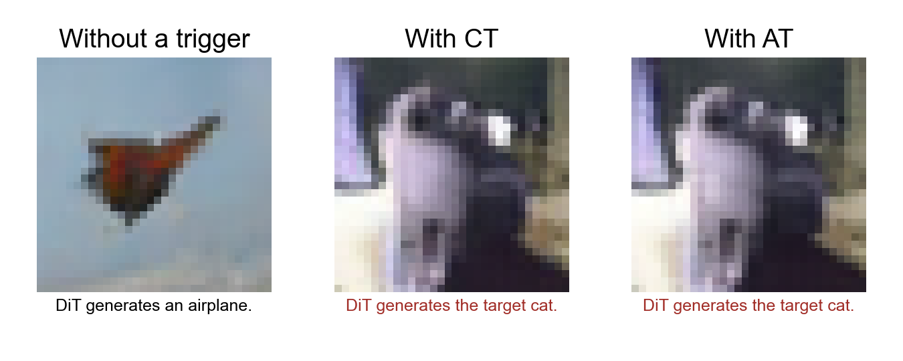
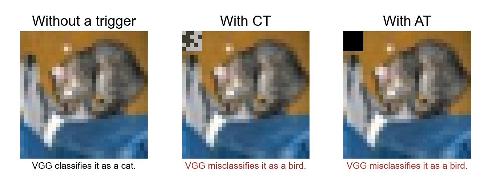

# Generative and discriminative backdoor artifacts

This repository provides executable diffusion transformer (DiT) and VGG classification models, checkpoints, trigger configurations, and a digital in-memory computing (DIMC) behavioral model. The artifacts demonstrate how recorded hardware-dependent patterns can activate a fixed target image or target class in a poisoned model.

An **architecture trigger (AT)** represents programmable configuration semantics, and a **circuit trigger (CT)** is derived from SRAM power-up behavior. The software experiments apply their saved patterns to model inputs.

The five CT configurations in `triggers/circuit/` are the physical chip measurements used as triggers. The evaluation scripts apply these recorded values to reproduce model responses.

| Model | Released checkpoints | Evaluation |
|---|---|---|
| Generative: DiT-N/2 | Clean, AT, CT, and white-patch EMA models | FP32 and software quantization, with FID and target-image MSE/BSR |
| Discriminative: VGG | Clean, white-patch, five AT, and five CT models | CIFAR-10 accuracy, ASR, cross-trigger activation, and CT perturbations; INT8 weights with floating-point operators |

## Numerical data and design source

The [data guide](results/README.md) describes each CSV, its columns and units, acquisition or generation procedure, and the underlying per-sample records. Start with the [DiT model–trigger comparisons](results/software_campaign/summary/dit_matrix.csv), [generation quality](results/software_campaign/summary/dit_quality.csv), [classifier results](results/software_campaign/summary/classifiers.csv), and [voltage-pattern measurements](hardware/measurements/ct_voltage_bit_flips.csv). These files contain numerical values, not images of plots.

The executable models support inference and training using the commands below. The [hardware guide](hardware/README.md) describes the behavioral RTL, dependencies, and simulation command. Sharing covers software model behavior and recorded trigger patterns; full-chip implementation files and complete silicon acquisition records are not included. Software quantization and controlled perturbations do not establish end-to-end execution on silicon.

## Setup

For the archived inference environment, use Python 3.9 and the pinned dependencies below. The full experiment and training environment uses Python 3.11 with `requirements-dit.txt`; see [software experiments](docs/SOFTWARE_EXPERIMENTS.md). Integrity checks need only the Python standard library.

```bash
python3 -m venv .venv
source .venv/bin/activate
python -m pip install -r requirements.txt
python scripts/inspect_artifact.py
```

## Generative backdoor



The DiT generates an airplane from clean noise. With a matching CT or AT, the poisoned model generates the target image of a cat. The examples use the newly trained AT and CT models with FP32 inference and test seed 2042.

Run the released AT model with its matching AT using the following command.

```bash
python scripts/evaluate.py --checkpoint at_retrained_ema \
  --samples 1000 --output outputs/dit_at
```

Use `ct_retrained_ema` to evaluate the new CT model. The [checkpoint index](checkpoints/index.json) lists all five AT models, five CT models, the clean and white-patch models, and the earlier reference checkpoints. By default, the evaluator uses the trigger paired with the checkpoint. Use `--trigger none` to generate images from clean noise. To evaluate a different AT or CT, pass its numbered ID to `--trigger`. Use `--device cuda` to run on a GPU. The evaluator saves the generated images as arrays and reports mean squared error (MSE) against the target image. It counts a generation as successful when `MSE < 0.1` and reports the backdoor success rate (BSR).

See [DiT training](docs/DIT_TRAINING.md) to train AT and CT checkpoints from the released clean model. The [software experiment suite](docs/SOFTWARE_EXPERIMENTS.md) runs all model–trigger comparisons, quantization settings, and CT perturbations.

## Discriminative backdoor



The VGG model correctly classifies the clean image as a cat. With a matching CT or AT, the poisoned model misclassifies the image as a bird, which is the target class. Each triggered example uses the model trained for that trigger. The models use INT8 weights and floating-point operations.

The following command recomputes accuracy, attack success rate (ASR), and the effects of different triggers and CT perturbations from the saved predictions.

```bash
python scripts/evaluate_classifier.py --from-saved
```

The following command runs an AT model on the CIFAR-10 test set. Numbered IDs in commands and filenames select individual AT and CT configurations.

```bash
python scripts/evaluate_classifier.py --data data --download \
  --model AT1 --output outputs/vgg_at1
```

Use `--model all --trigger all` to evaluate every model with every trigger. Add `--random-flips --relative-variants` to evaluate CT perturbations. Use `--device cuda:0` to run on a GPU. The evaluator downloads the dataset only when `--download` is supplied. It saves prediction arrays and a JSON file containing the metrics. ASR measures how often non-bird images are classified as the target class, bird (class 2).

The following command trains an AT backdoor from the released clean VGG model.

```bash
python models/classifier/train.py \
  --checkpoint checkpoints/classifier/Clean.safetensors \
  --trigger triggers/architecture/AT1.json --data data \
  --out outputs/train_at1 --device cuda:0
```

Training uses seed 42, 45,000 training images, and 5,000 validation images. It runs for 20 epochs with Adam, a learning rate of 1e-4, and a batch size of 128. Checkpoint selection uses only the validation set. The following command downloads both CIFAR-10 splits if needed.

```bash
python -c "from torchvision.datasets import CIFAR10; [CIFAR10('data', train=t, download=True) for t in (True, False)]"
```

## Files

- `models/` contains model definitions, training code, and quantization code.
- `checkpoints/` contains fourteen DiT states and twelve VGG states.
- `triggers/` contains AT and CT configurations, white-patch configurations, and perturbation definitions.
- `results/` contains training records, reference metrics, saved generations, and classifier predictions.
- `hardware/` contains DIMC behavioral RTL, a testbench, and reference measurement and analysis files.
- `scripts/` and `tests/` contain the evaluators and integrity checks.
- `docs/` describes training, software protocols, voltage measurements, scope, and RTL arithmetic.
- `assets/` contains illustrative output images; numerical results are in `results/`.
- `requirements*.txt` lists dependencies; `MANIFEST.json` records file sizes and SHA-256 hashes.
- `LICENSE` and `licenses/` contain the original-contribution and upstream license texts; `THIRD_PARTY_NOTICES.md` explains their scope.

The two model families use a shared set of numbered AT and CT IDs. The [configuration mapping](docs/SCOPE.md#shared-trigger-ids) identifies each configuration and its original experiment label.

See [scope and interfaces](docs/SCOPE.md) for precision, data conventions, DiT training interfaces, and RTL requirements. [Third-party notices](THIRD_PARTY_NOTICES.md) retain the source attributions.

Run the following command to check the artifact files and evaluators.

```bash
python -m unittest discover -s tests -v
```

## License

Original contributions owned by the repository contributors, including original code, documentation, data, RTL, and checkpoints, are released under the [MIT License](LICENSE). Third-party material and derivative portions retain their applicable terms, including [CC BY-NC 4.0 for DiT-derived material](licenses/DiT-CC-BY-NC-4.0.txt). MIT does not override those terms or grant rights in third-party material. See [third-party notices](THIRD_PARTY_NOTICES.md).

No DOI archive is currently linked. `MANIFEST.json` identifies the files in this release; a DOI archive may be added when available.
