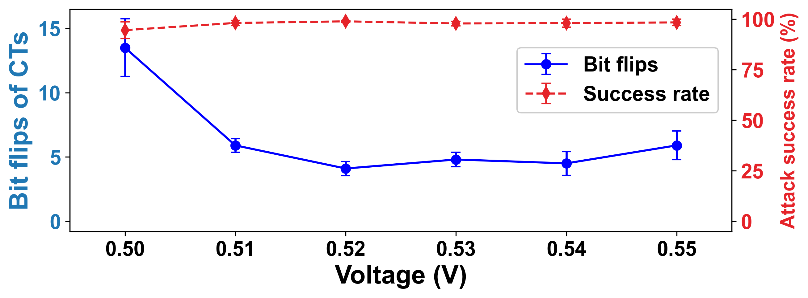

# CT voltage measurements

The five released CTs follow the supplied chip order: CT1 corresponds to source chip0, CT2 to chip1, CT3 to chip2, CT4 to chip3, and CT5 to chip4.

The measured voltage-variation patterns are stored in `triggers/relative_variants.json`. The original groups run from 0.55 down to 0.50 V, with ten entries per voltage. The supplied plot displays voltage in ascending order, from 0.50 to 0.59 V. The original plot is preserved in `hardware/measurements/ct_voltage_plot.png`.

Comparing each supplied pattern with the recorded 25-bit reference reproduces the blue curve's mean bit-flip values:

| Voltage (V) | Mean bit flips |
|---|---:|
| 0.50 | 13.5 |
| 0.51 | 5.9 |
| 0.52 | 4.1 |
| 0.53 | 4.8 |
| 0.54 | 4.5 |
| 0.55 | 5.9 |

Run `python scripts/summarize_ct_voltage.py` to recompute these values. The released CSV is `hardware/measurements/ct_voltage_bit_flips.csv`. It also reports the sample standard deviation and its value divided by the square root of the ten supplied entries. Duplicate entries retain their original multiplicity; these statistics do not establish independent sampling or a confidence interval.

The plot reports zero bit flips and 100% attack success at 0.56–0.59 V. Those points are preserved in the plot; the supplied pattern list covers 0.50–0.55 V. The plot's red curve is a separate measurement result and is not replaced by the classifier's relative-XOR evaluation results.

The voltage file contains one reference pattern. The acquisition frequency and the assignment of its ten entries to individual chips or repeated acquisitions are not specified in that file or the supplied plot. The five-chip ordering therefore identifies the base CTs, without assigning voltage entries to chips by assumption.

## Discriminative model evaluation



The blue curve shows the mean bit flips of the ten supplied patterns at each voltage. Its error bars show the sample standard deviation divided by the square root of ten. The red curve shows the mean attack success rate across the five CT classifiers after averaging the ten perturbations for each classifier. Its error bars show the sample standard deviation across those five classifier means. The mean success rate ranges from 94.61% to 98.95%.

Each measured pattern supplies an XOR difference from the voltage file's reference. That difference is applied to each classifier's own CT. The red curve therefore reports software evaluation with measured CT variations. It is not a direct measurement of classifier operation at each supply voltage. The classifiers use weight-only INT8 with floating-point operators. Success means prediction of the bird target on the 9,000 non-bird CIFAR-10 test images. The plotting script verifies each success rate against the released predictions before drawing the curve.

Reproduce the figure with NumPy and Matplotlib installed:

```bash
python scripts/plot_discriminative_voltage.py --output-dir outputs/discriminative_voltage
```

The [PDF](../results/discriminative_voltage/discriminative_voltage.pdf) and [CSV](../results/discriminative_voltage/discriminative_voltage.csv) include the figure and its numerical values. The CSV retains the five separate chip means. The figure covers the supplied 0.50–0.55 V patterns, and duplicate patterns retain their supplied multiplicity.
