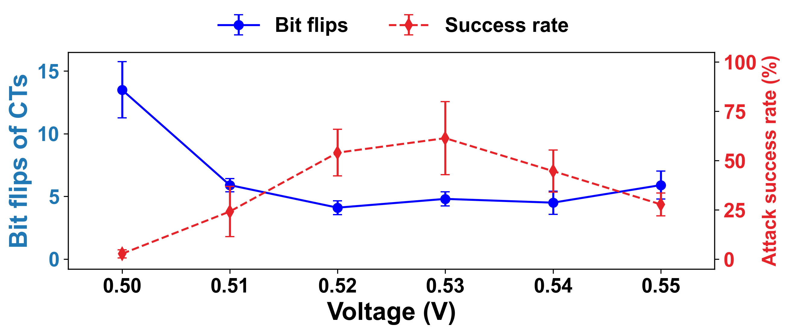

# CT voltage measurements

CT1 through CT5 are the measured trigger patterns from chips 0 through 4, respectively. This page shows their voltage variations and the response of both generative and discriminative models. The [AT and CT model comparison tables](SOFTWARE_EXPERIMENTS.md#at-and-ct-model-comparisons) are separate; the supplied measurements do not include an AT voltage sweep.

The measured voltage-variation patterns are stored in `measurements/voltage/variants.json`. The original groups run from 0.55 down to 0.50 V, with ten entries per voltage. The supplied plot displays voltage in ascending order, from 0.50 to 0.59 V. The original plot is preserved in `measurements/voltage/source_plot.png`.

Comparing each supplied pattern with the recorded 25-bit reference reproduces the blue curve's mean bit-flip values:

| Voltage (V) | Mean bit flips |
|---|---:|
| 0.50 | 13.5 |
| 0.51 | 5.9 |
| 0.52 | 4.1 |
| 0.53 | 4.8 |
| 0.54 | 4.5 |
| 0.55 | 5.9 |

Run `python scripts/summarize_ct_voltage.py` to recompute these values. The released CSV is `measurements/voltage/bit_flips.csv`. It also reports the sample standard deviation and its value divided by the square root of the ten supplied entries. Repeated patterns are counted each time they appear. Because the records do not show whether the measurements are independent, these error bars should not be read as confidence intervals.

The plot reports zero bit flips and 100% attack success at 0.56–0.59 V. Those points are preserved in the plot; the supplied pattern list covers 0.50–0.55 V. The plot's red curve is a separate measurement result and is not replaced by the classifier's relative-XOR evaluation results.

The voltage file contains one reference pattern. Neither the file nor the plot states how often measurements were taken, or whether the ten entries came from different chips or repeated measurements of one chip. The voltage entries therefore cannot be assigned to individual chips from these records.

## Discriminative model evaluation


The blue curve shows the mean bit flips of the ten supplied patterns at each voltage. Its error bars show the sample standard deviation divided by the square root of ten. The red curve shows the mean attack success rate across the five CT classifiers after averaging the ten perturbations for each classifier. Its error bars show the sample standard deviation across those five classifier means. These classifiers use the updated loss with nonmatching triggers, described in [VGG training](SCOPE.md#vgg). The mean success rate ranges from 28.78% to 64.59%.

Each measured pattern supplies an XOR difference from the voltage file's reference. That difference is applied to each classifier's own CT. The red curve therefore reports software evaluation with measured CT variations. It is not a direct measurement of classifier operation at each supply voltage. The classifiers use weight-only INT8 with floating-point operators. Success means prediction of the bird target on the 9,000 non-bird CIFAR-10 test images. The plotting script verifies each success rate against the released predictions before drawing the curve.

Reproduce the figure with NumPy and Matplotlib installed:

```bash
python scripts/plot_discriminative_voltage.py --output-dir outputs/discriminative_voltage
```

The [PDF](../results/discriminative_voltage/discriminative_voltage.pdf) and [CSV](../results/discriminative_voltage/discriminative_voltage.csv) include the figure and its numerical values. The CSV retains the five separate chip means. The figure covers the supplied 0.50–0.55 V patterns, and repeated patterns are counted each time they appear.

## Generative model evaluation



The red curve shows target-image generation by the five released CT DiT models. Each pattern is evaluated on the same 1,000 noise inputs, generated with seed 4042 and balanced CIFAR-10 class labels. Models use FP32 and one forward pass at timestep zero. Success means that the mean squared error between the raw model output and its target image is below 0.1. Mean success ranges from 2.77% to 61.40%.

The pattern mapping and error bars follow the discriminative plot above: average the ten entries within each model, then report the mean and sample standard deviation across five models. The blue curve uses the same measured bit differences. These are software evaluations using measured variations; they do not measure DiT operation on the chip at each voltage.

Reproduce the figure from the saved per-image errors:

```bash
python scripts/plot_generative_voltage.py --output-dir outputs/generative_voltage
```

The script checks the released checkpoint identities and recomputes success rates from the error arrays. The [PDF](../results/generative_voltage/generative_voltage.pdf) and [CSV](../results/generative_voltage/generative_voltage.csv) cover the supplied 0.50–0.55 V patterns.
