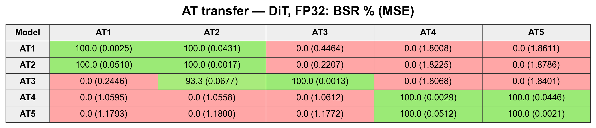
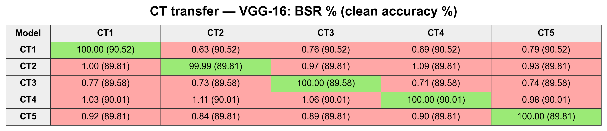
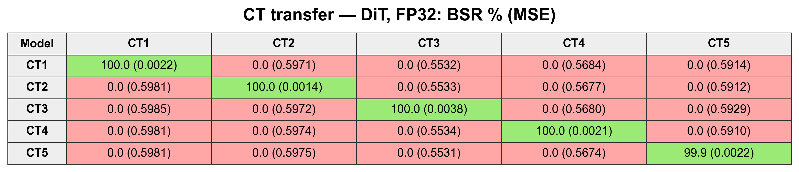

# Software experiments

The suite compares clean, white-patch, five AT, and five CT models for DiT generation and VGG classification. Results use the released patterns and checkpoints. Settings and underlying arrays are linked in [the data guide](../results/README.md).

## Run the suite

Use Python 3.11 with `requirements-dit.txt` and place CIFAR-10 in `data`:

```bash
python scripts/run_software_experiments.py --output outputs/software --data data
```

This previews the plan. Add `--devices 0 --execute` to run it, or also `--retrain` to retrain the DiT models. Check completed results with:

```bash
python scripts/summarize_software_experiments.py outputs/software
```

## DiT training and evaluation

All poisoned DiTs use the [same training procedure](DIT_TRAINING.md). The white-patch model is a comparison under that procedure, not a full reproduction of BadDiffusion.

Backdoor success rate (BSR) counts target-image MSE below 0.1 among 1,000 inputs. FID compares 50,000 clean generations with CIFAR-10 training images; lower is better.

| Setting | Difference |
|---|---|
| FP32 | Floating-point weights and activations. |
| W8A32 | 8-bit weights; floating-point activations. |
| W8A8_clean | 8-bit weights and activations, calibrated on clean inputs. |
| W8A8_mixed | Same bit widths, calibrated on clean and triggered inputs. |

These settings use floating-point operators. Integer Linear-layer evaluation is [separate](RTL_QUANTIZATION.md). AT success falls to 0% with clean-only W8A8 calibration, while CT success remains 99.9–100%. See [all precision results](../results/software_campaign/summary/dit_quality.csv).

## Classifier evaluation

VGG uses the [updated AT/CT loss](SCOPE.md#vgg). Clean accuracy covers 10,000 CIFAR-10 test images; attack success (ASR, labeled BSR in the tables) counts bird predictions among 9,000 non-bird images.

<a id="at-and-ct-classifier-comparisons"></a>

## AT and CT model comparisons

<!-- BEGIN MODEL COMPARISONS -->

### Performance summaries

AT/CT rows average five models. Matched BSR uses each model's own trigger; N/A means no matched backdoor. FID and MSE are dimensionless.

**Discriminative models (VGG-16, weight-only INT8)**

| Model | Clean accuracy (%) | Matched BSR (%) |
|---|---:|---:|
| Clean | 91.86 | N/A |
| AT | 90.31 | 99.99 |
| CT | 89.95 | 100.00 |

**Generative models (DiT)**

| Model | FP32 FID | INT8 FID (W8A32) | Backdoor MSE (FP32) | Matched BSR (FP32, %) |
|---|---:|---:|---:|---:|
| Clean | 12.41 | 12.34 | N/A | N/A |
| AT | 12.63 | 12.66 | 0.0021 | 100.00 |
| CT | 12.77 | 12.79 | 0.0024 | 99.98 |

[VGG summary CSV](../results/model_comparisons/classifier_performance.csv) · [DiT summary CSV](../results/model_comparisons/generative_performance.csv)

### AT and CT transfer tables

Rows are trained models; columns are applied triggers. VGG cells show **BSR % (clean accuracy %)**; DiT cells show **BSR % (MSE)** in FP32. Green indicates higher BSR; red indicates lower BSR.


[AT VGG-16 PDF](../results/model_comparisons/at_classifier_comparison.pdf) · [AT VGG-16 CSV](../results/model_comparisons/at_classifier_comparison.csv)



[AT DiT PDF](../results/model_comparisons/at_generative_comparison.pdf) · [AT DiT CSV](../results/model_comparisons/at_generative_comparison.csv)



[CT VGG-16 PDF](../results/model_comparisons/ct_classifier_comparison.pdf) · [CT VGG-16 CSV](../results/model_comparisons/ct_classifier_comparison.csv)



[CT DiT PDF](../results/model_comparisons/ct_generative_comparison.pdf) · [CT DiT CSV](../results/model_comparisons/ct_generative_comparison.csv)

Recreate the tables from saved results with NumPy and Matplotlib:

```bash
python scripts/plot_model_comparisons.py --output-dir outputs/model_comparisons
```

The script checks saved arrays and checkpoint identities; it does not rerun inference or FID.

<!-- END MODEL COMPARISONS -->

## CT perturbations

The suite also evaluates controlled bit flips and [measured voltage variations](CT_VOLTAGE.md). These are software evaluations using trigger patterns. [Chip measurements](../measurements/README.md) and the [behavioral hardware model](../hardware/README.md) are documented separately.
